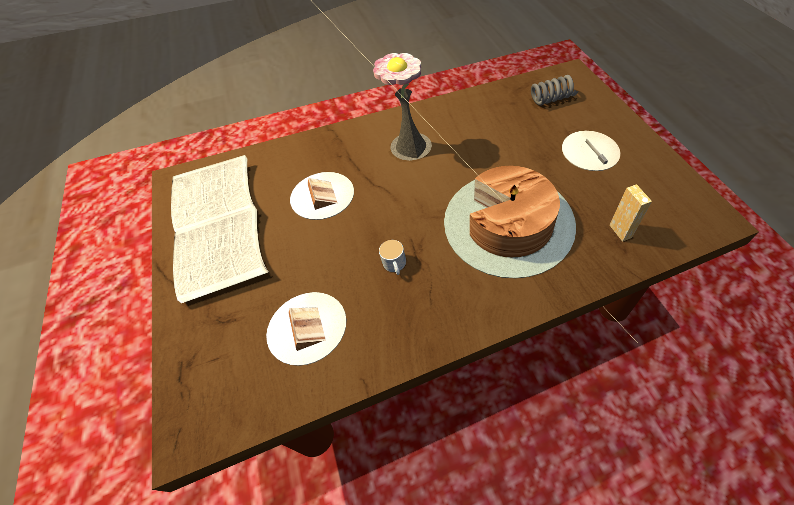

# SGI  - TP1

----
## Project information

- Strong Points
  - Successfully implemented a variety of geometry objects with high precision.
  - Focus on details in object positioning, lighting, and overall scene structure.
  - Use of Three.js materials and textures to create realistic surfaces.

- Scene Description
  - Overview: The scene represents an indoor room with a table at its center, surrounded by decorative elements like paintings and a carpet.

  - Table and Items: A central table with detailed items on top, including a cake with a candle and other utensils, showcasing proficiency with geometry.

  

  - Room Decorations: Walls are decorated with framed paintings, adding to the realism and depth of the scene.

  

  - Lighting: Includes a spot light that highlights the table and targeted to the cake, creating a cozy ambiance.

  

  - Textures: Careful selection and application of textures for walls, floor, and table, enhancing the visual appeal.

  

----
## Issues/Problems

- Curved Surfaces: Curved surfaces, such as the newspaper and the jar, were challenging to create at first, though resolved with effort and persistence.
- Implemented Features: All intended features were successfully implemented.
- Known Bugs: There are no known bugs or problems at this time.

----

This project was created for Interative Graphics Systems - FEUP by:

- Elton Tamele
- Maureen Ah-shú
