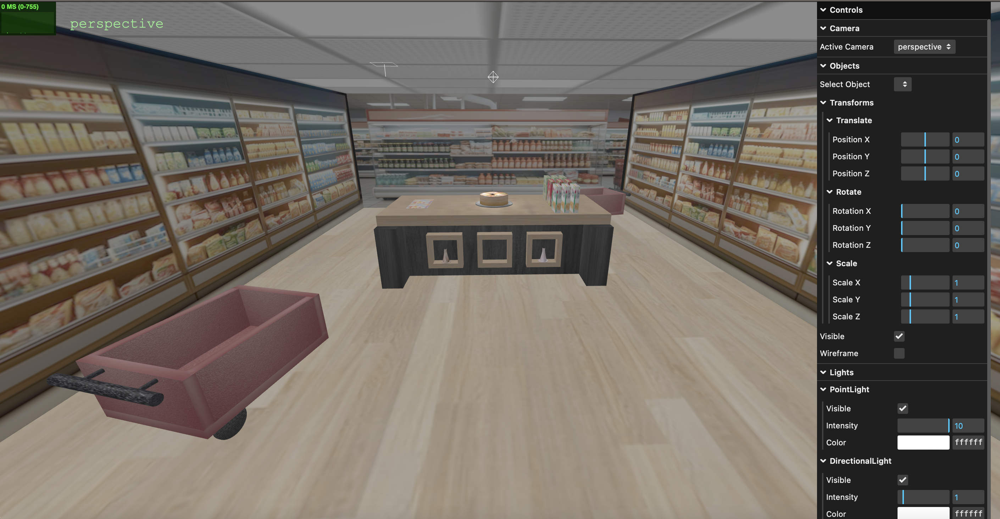
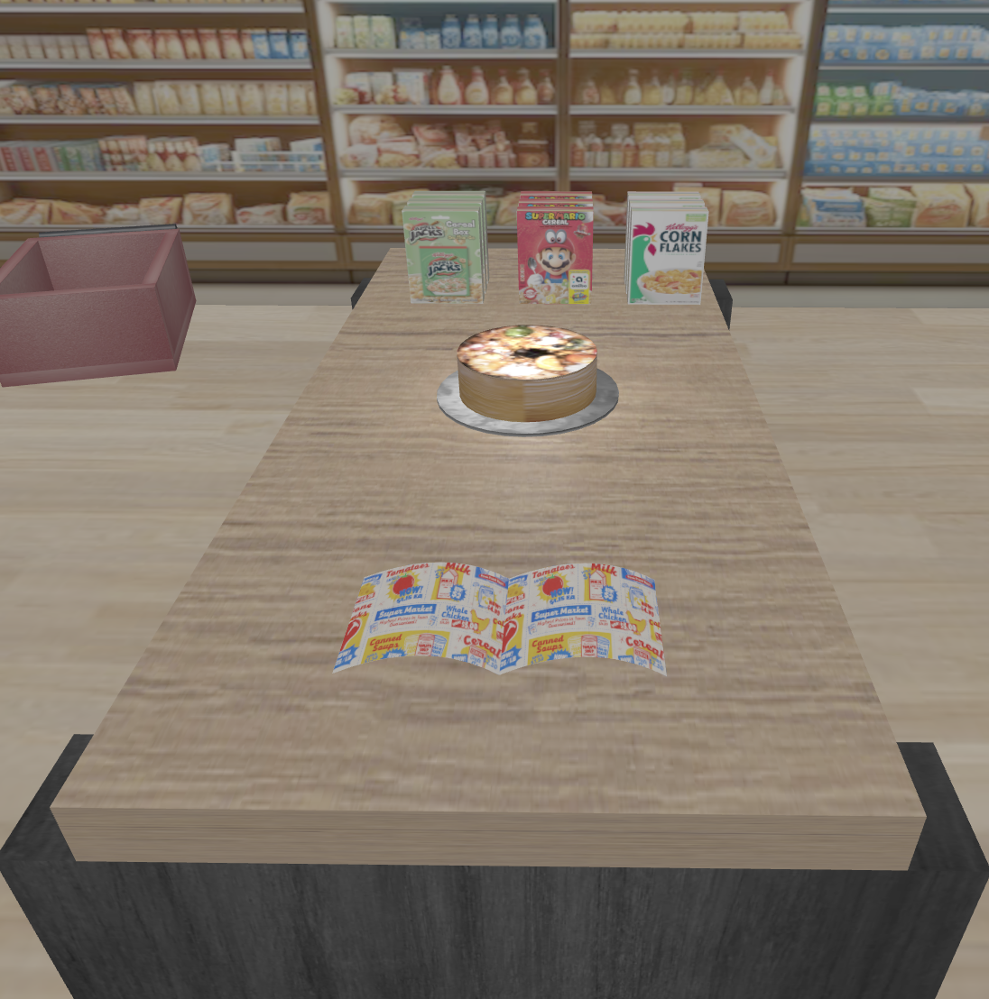
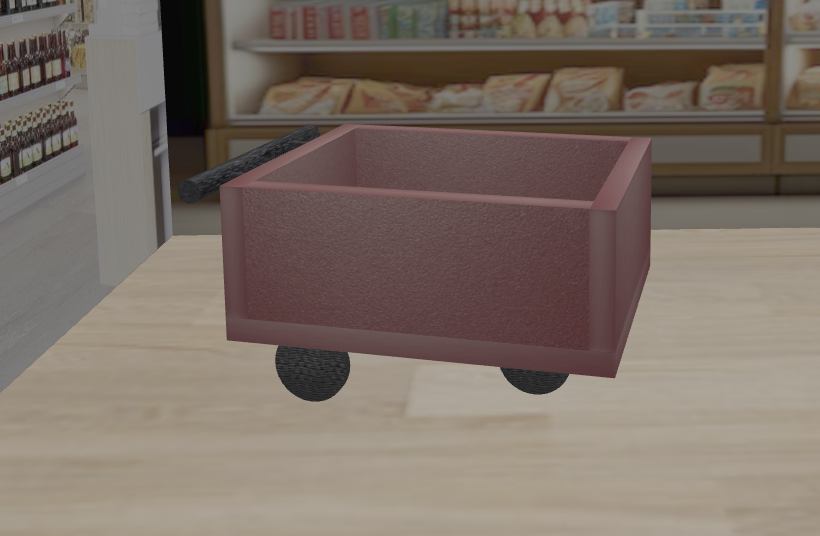

# SGI 2024/2025 - TP2

## Group: T02G05

| Name             | Number    | E-Mail             |
| ---------------- | --------- | ------------------ |
| Elton Tamele     | 201908676 | up201908676@up.pt  |
| Maureen Ah-shú   | 201708043 | up201708043@up.pt  |

----

## Project information

This project demonstrates a custom implementation in Three.js, focusing on dynamically building and rendering 3D scenes using JSON-based data structures.

- Dynamic Scene Construction: The application processes hierarchical JSON data to construct scenes, enabling flexibility and scalability.
- Support for Multiple Primitive Types: Includes rendering of boxes, spheres, triangles, rectangles, cylinders, and NURBS surfaces.
- Advanced Material Support: Implements materials with diffuse, specular, emissive properties, and supports bump textures, video textures, and custom mipmaps.
- Lighting: Supports point, spot, and directional lights for enhanced visual realism.

- Scene
  - The created scene is based on a supermarket. Each node represents an object or light, allowing for recursive and reusable scene construction. The project includes textured primitives, applied transformations (translation, rotation, scaling), and lighting setups.
  - 
  - 

----

## Issues/Problems

- Unimplemented Features:
  - Lack of shadows for specific objects.

- Problems:
  - Inconsistent mipmap handling.

