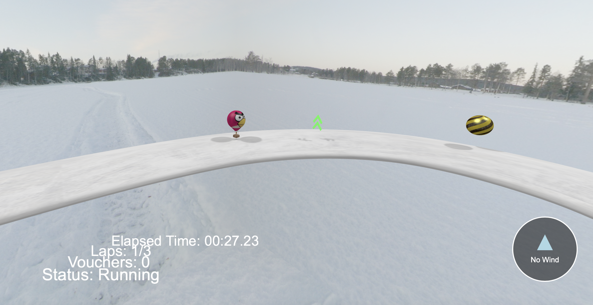
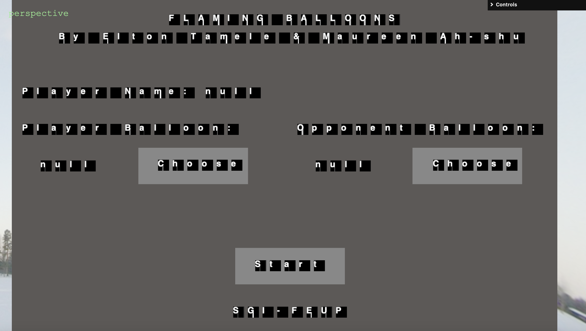
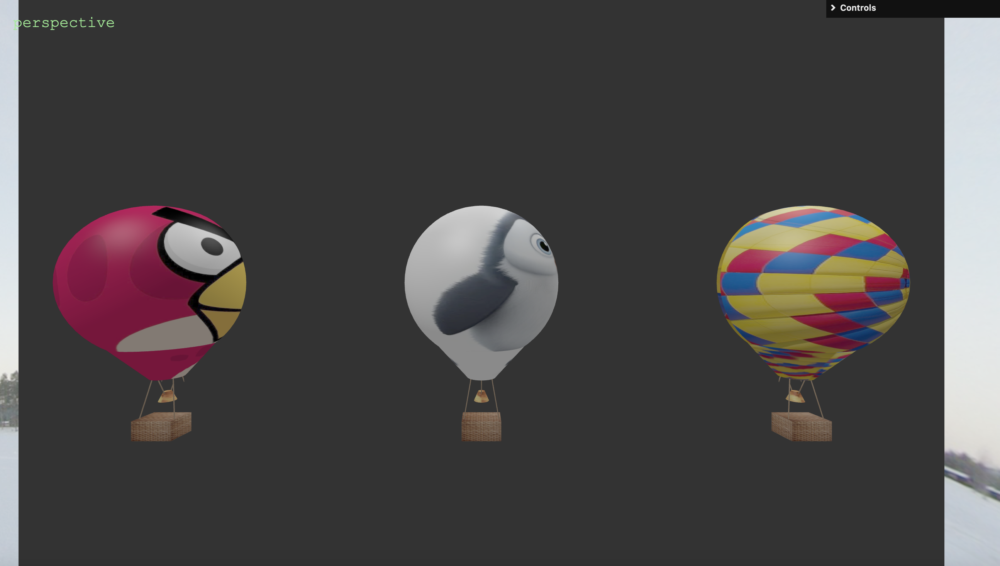

# SGI - TP3
----
## Project information
This project is a 3D simulation environment developed using Three.js. It is an Hot Air Balloon Race game implementation with intuitive balloon control system that responds to different wind layers.

- Scene
  - The scene features a realistic environment with a parking lot for balloons, a dynamic race track, and interactive player elements. The user can interact with various objects, adjust their properties, and track gameplay progress through the HUD.
  - 
  - 
----
## Issues/Problems

- One of the biggest challenges was ensuring the game is intuitive and accessible while maintaining the complexity of controlling a hot air balloon in different wind layers.

----

This project was created for Interative Graphics Systems - FEUP by:

- Elton Tamele
- Maureen Ah-shú
